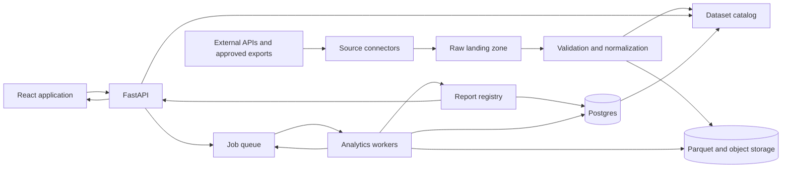

# Financial Markets Research

Financial Markets Research is a reproducible analytics platform for event studies, market microstructure research, strategy evaluation, and cross-asset data analysis.

The platform is designed to ingest heterogeneous market data, normalize it into versioned contracts, validate data quality, execute analytical jobs, publish traceable research artifacts, and expose results through a FastAPI service and React interface.

> Research outputs are informational and do not constitute investment advice.

## Platform capabilities

- Collect data from exchange, macroeconomic, regulatory, market-data, and approved research APIs.
- Normalize heterogeneous source payloads into canonical point-in-time datasets.
- Store analytical data in Parquet with a versioned catalog and reproducible manifests.
- Validate identity, timestamps, gaps, duplicates, completeness, licensing, and lineage.
- Execute event studies, market microstructure analysis, strategy simulations, and risk research as asynchronous jobs.
- Publish machine-readable results, static reports, figures, diagnostics, and uncertainty estimates.
- Serve datasets, job state, studies, and reports through a read-only analytical API.
- Visualize coverage, forward outcomes, costs, liquidity, drawdown, order flow, and research readiness.

## System overview



The architecture separates the data plane from the control plane. Data moves through acquisition, normalization, versioned storage, and analytical processing. Commands, job state, validation failures, progress, and published results return through the queue, metadata store, API, and user interface.

See [Architecture](docs/ARCHITECTURE.md) for service boundaries, execution flows, storage responsibilities, and scaling rules.

## Implementation strategy

The diagram describes the target architecture, not the first delivery milestone. Implementation begins as a CLI-based modular Python package that acquires one bounded public dataset, writes validated Parquet, queries it through DuckDB, and produces one reproducible static research report.

FastAPI, React, Postgres, background workers, and a queue are introduced as later vertical slices after their contracts and operational requirements are demonstrated by working research flows. Package boundaries are established early so components can be separated without requiring premature service deployment.

## Repository structure

```text
apps/
  api/                  FastAPI analytical and control API
  worker/               ingestion, validation, and research jobs
  web/                  React application
packages/
  contracts/            canonical schemas and generated types
  connectors/           external API and export adapters
  datasets/             Parquet, DuckDB, catalog, and validation
  research/             event studies and analytical modules
  reporting/            figures, tables, manifests, and report artifacts
data/
  sample/               small reviewed datasets and fixtures
docs/
  ARCHITECTURE.md
  DATA_CONTRACTS.md
  DEVELOPMENT.md
  RESEARCH_METHODOLOGY.md
infra/
  docker/               local and deployment composition
  migrations/           metadata database migrations
  monitoring/           metrics, health checks, and alerts
reports/
  figures/              reviewed publication figures
schemas/                machine-readable dataset and report contracts
tests/                   unit, contract, integration, and regression tests
ROADMAP.md               delivery milestones and acceptance gates
```

Components are introduced as vertical slices. The documented boundaries are stable targets, while physical service separation is driven by measured scaling, reliability, and operational requirements.

## Research domains

### Event studies

Measure behavior before and after timestamped events such as listings, delistings, announcements, large price moves, liquidations, protocol events, filings, and macroeconomic releases.

### Market microstructure

Analyze public trades, order-flow imbalance, spread, depth, impact, liquidity, open interest, funding, and cross-venue lead-lag relationships.

### Strategy evaluation

Evaluate entry, exit, execution, sizing, and risk policies with point-in-time eligibility, realistic costs, missing-path handling, and frozen evaluation contracts.

### Cross-asset and risk research

Study volatility, correlation, drawdown, turnover, factor exposure, allocation, and regime behavior across cryptoassets, equities, rates, currencies, and commodities.

## Schurfer integration

Schurfer is a separate market-monitoring and strategy-research system. This platform may consume immutable, sanitized, versioned research exports produced by Schurfer, alongside independently acquired public data.

The integration boundary does not permit production credentials, direct production database access, private configuration, unrestricted context payloads, or order execution. Research exports are treated like any other versioned source and must pass schema, provenance, licensing, and quality validation before use.

## Data model

Every analytical dataset is expected to provide:

- a stable dataset identifier and schema version;
- source and retrieval provenance;
- event, publication, observation, and ingestion times when available;
- UTC coverage bounds and row counts;
- source-code and dependency versions;
- content checksums;
- censoring and missing-data policy;
- licensing and redistribution status;
- known limitations and quality diagnostics.

Large datasets are stored outside Git. The repository contains acquisition logic, contracts, small reviewed samples, tests, report definitions, and manifests. See [Data contracts](docs/DATA_CONTRACTS.md).

## Command surface

The project will expose a stable command surface through the root `Makefile` as capabilities are implemented:

```bash
make bootstrap       # install locked Python dependencies (adds Node once the web milestone starts)
make dev             # start local infrastructure and applications
make check           # run formatting, lint, types, and tests
make data            # acquire or prepare configured datasets
make validate        # validate contracts and data quality
make report          # generate registered reports and figures
make api-client      # regenerate the TypeScript client from OpenAPI
```

Commands are added only when their implementation and verification are present. See [Development](docs/DEVELOPMENT.md) for the planned workspace bootstrap and contribution workflow.

## Research integrity

- Research questions and eligibility rules are defined before interpreting outcomes.
- Discovery, validation, and prospective evaluation remain separate evidence stages.
- Missing data and right-censored outcomes are explicit states, not implicit zeros.
- Results include sample size, asset diversity, time coverage, uncertainty, and concentration diagnostics.
- Tradability claims include fees, spread, market impact, latency, funding, and failed-execution assumptions where applicable.
- Reusable calculations live in tested packages rather than only in notebooks.
- Every published result is traceable to dataset versions, code revision, configuration, and generated artifacts.

See [Research methodology](docs/RESEARCH_METHODOLOGY.md).

## Delivery status

The repository is currently establishing its documentation, code license, Python foundation, dataset contract, and first public-data research slice. Planned milestones are maintained in [ROADMAP.md](ROADMAP.md).

## License and data usage

The project code license and the licenses of individual datasets are separate concerns. No external dataset may be redistributed until its source, terms, attribution requirements, and permitted use have been documented.

See [LICENSE](LICENSE).
