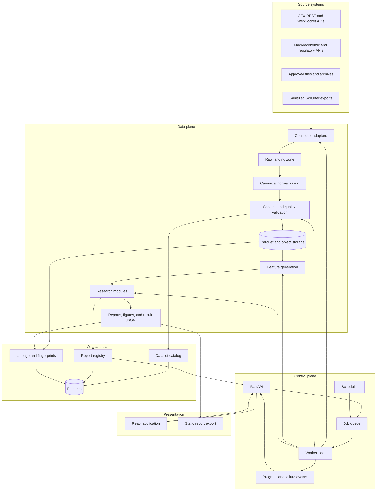

# Architecture

## Objectives

The platform must support reproducible market research across heterogeneous sources without coupling analytical logic to a specific exchange, storage engine, user interface, or private production system.

The architecture prioritizes:

- point-in-time correctness and explicit provenance;
- deterministic, versioned analytical inputs;
- bounded acquisition and processing;
- asynchronous execution with observable progress and failure state;
- separation between analytical computation and presentation;
- independent scaling of ingestion, research workers, API, and storage;
- traceability from every published metric to source data and code revision;
- secure isolation of credentials and private exports.

## Implementation strategy

This document defines target logical boundaries. It does not require every component to exist as an independent service from the first release.

Implementation proceeds through evidence-producing vertical slices:

1. A CLI-based modular Python package acquires one bounded public dataset, validates it, writes Parquet, queries it with DuckDB, and generates a static report.
2. Canonical dataset and report contracts are stabilized from working outputs.
3. FastAPI exposes real catalog and report resources after those resources exist.
4. React visualizes the established API contract and generated report data.
5. Background workers, Postgres, and a queue are introduced when scheduled execution, durable job state, retries, concurrency, or interactive progress create a measured requirement.
6. Logical components become separate deployables only when independent scaling, failure isolation, release cadence, security, or ownership provides concrete value.

The initial runtime is therefore a modular monolith with explicit package boundaries, not a distributed platform assembled before the first research result.

## Planes

### Data plane

The data plane moves immutable and append-only data through acquisition, landing, normalization, validation, storage, feature generation, and report production.

### Control plane

The control plane accepts authorized job requests, schedules work, records progress, handles retries, exposes failure state, publishes completed artifacts, and returns status to API clients.

### Metadata plane

The metadata plane stores dataset identity, schema versions, source provenance, job state, report registry entries, quality summaries, lineage, and access policy. Large analytical payloads remain outside the metadata database.

## Logical architecture



## Target deployable applications

### `apps/api`

FastAPI provides authenticated access to datasets, quality diagnostics, research definitions, jobs, reports, and generated artifacts.

Responsibilities:

- validate API requests;
- submit bounded jobs to the queue;
- expose job status and validation failures;
- read metadata and report registry state;
- issue signed artifact URLs when required;
- publish an OpenAPI contract for generated clients;
- avoid performing heavy analytics inside request handlers.

### `apps/worker`

The worker executes ingestion, normalization, validation, feature generation, research, and report jobs.

Responsibilities:

- claim idempotent jobs;
- enforce source and resource limits;
- emit progress and structured failure events;
- write immutable datasets and artifacts;
- register fingerprints and lineage;
- retry only classified transient failures;
- fail closed when contracts or completeness gates are violated.

Worker pools may later be separated by workload class, such as network-bound ingestion, CPU-bound analytics, or memory-intensive historical replay. They begin as one deployable application with internal job-type isolation.

### `apps/web`

The React application presents dataset state, quality, research configuration, job progress, diagnostics, and report results.

Responsibilities:

- consume generated TypeScript API clients;
- present filters and drill-down navigation;
- display population, units, periods, exclusions, and uncertainty on every analytical chart;
- never duplicate cohort selection or statistical calculations in browser code;
- provide download links for approved artifacts;
- show stale, incomplete, failed, and collecting states explicitly.

## Core packages

### `packages/contracts`

Canonical models for source observations, instruments, events, datasets, jobs, studies, metrics, reports, and manifests. JSON Schema, Python types, database projections, and generated TypeScript types derive from these contracts where practical.

### `packages/connectors`

Adapters for external systems. Every connector owns authentication requirements, pagination, rate limits, retries, source-specific parsing, raw provenance, and bounded request behavior.

Connectors emit source observations and do not contain research policy. Exchange-specific behavior remains isolated from canonical normalization.

### `packages/datasets`

Dataset construction, Parquet layout, DuckDB access, partitioning, catalog integration, checksums, quality checks, and immutable version publication.

### `packages/research`

Research families implemented as versioned modules with explicit input contracts, configuration, eligibility, outcomes, uncertainty, and interpretation state.

Initial namespaces:

```text
research/
  event_studies/
  market_microstructure/
  orderflow/
  strategy_evaluation/
  cross_asset/
  risk/
```

### `packages/reporting`

Transforms validated research results into canonical result JSON, Markdown, HTML, tables, and figures. Presentation artifacts must not recompute analytical populations independently.

## Storage responsibilities

### Object storage and Parquet

Object storage contains immutable raw snapshots, normalized datasets, features, and generated artifacts. Parquet is the default analytical interchange format because it supports typed columns, compression, projection, partition pruning, and direct access from multiple engines.

### DuckDB

DuckDB is the default local and report-time analytical engine for Parquet. It avoids loading complete datasets into Python memory and supports reproducible SQL projections without introducing a distributed cluster prematurely.

### Postgres

Postgres stores bounded metadata:

- source and instrument registry;
- dataset catalog and schema version;
- acquisition and processing jobs;
- quality summaries;
- research definitions and report runs;
- artifact locations and fingerprints;
- lineage and operational state.

Large event rows, raw trades, candles, and complete report payloads do not belong in metadata tables unless a measured access pattern requires a dedicated projection.

### Queue and transient state

Redis, NATS, or another selected queue transports job commands, progress, leases, and transient coordination state. The implementation is chosen during the first asynchronous vertical slice. Postgres remains the durable source for externally visible job and report state.

## Connector lifecycle

```text
schedule or API request
        -> create acquisition job
        -> apply source rate and time bounds
        -> fetch source pages or stream window
        -> persist immutable raw response metadata
        -> normalize into canonical records
        -> validate schema and quality
        -> publish dataset version
        -> register manifest and lineage
        -> emit completion or structured failure
```

Source-specific retries must not create duplicate dataset versions. Idempotency keys include source, request contract, requested time range, and schema version.

## Research job lifecycle

```text
registered study definition
        -> resolve immutable dataset versions
        -> verify readiness and completeness
        -> materialize eligible population
        -> execute metrics and uncertainty
        -> generate diagnostics and artifacts
        -> register code revision and fingerprints
        -> publish result state
        -> expose through API and web
```

A failed validation, missing source version, incomplete horizon, or fingerprint mismatch prevents publication. Partial diagnostics may be retained as failed-job metadata but cannot be presented as a completed result.

## Result return and progress

The system returns more than final data:

- job acceptance with stable job ID;
- queued, running, retrying, failed, cancelled, and completed state;
- progress counters and current stage;
- structured validation and source errors;
- dataset and report version identifiers;
- signed or direct artifact locations;
- freshness and readiness state;
- lineage linking outputs to inputs.

The web application initially polls bounded job-status endpoints. Server-Sent Events may be introduced for efficient progress updates. WebSocket transport is reserved for interactions that require bidirectional low-latency state rather than adopted by default.

## External API expansion

The connector interface supports multiple source families without placing all APIs in one process contract:

- crypto venues through CCXT and official exchange APIs;
- macroeconomic sources;
- regulatory filings and announcements;
- corporate actions and listings;
- market calendars and reference data;
- approved news and event feeds;
- sanitized internal research exports.

Each new source requires a documented license, timestamp semantics, identity mapping, pagination behavior, rate policy, fixture strategy, and data-quality report before it becomes an accepted research input.

## Observability

Every deployable application exposes health and readiness state. Operational telemetry includes:

- job queue depth and oldest age;
- source request rate, latency, retries, and errors;
- normalization and validation failures;
- rows and bytes processed;
- dataset publication latency;
- worker CPU, memory, and active jobs;
- artifact generation time;
- API latency and error rate;
- data freshness and coverage;
- storage growth and retention state.

Metrics must distinguish system health from research readiness. A healthy worker can process an insufficient dataset, and a complete dataset can still produce an invalid research result.

## Security boundaries

- Secrets are loaded from environment or an external secret store and never committed.
- API credentials are scoped per connector and unavailable to the web application.
- Schurfer integration is file or object based and contains no production control channel.
- Uploaded and exported datasets are validated before catalog registration.
- Artifact access follows dataset publication policy.
- The analytical API is read-only with respect to trading systems.
- Job submission accepts registered job types and bounded parameters rather than arbitrary code.

## Scaling strategy

Scaling follows observed bottlenecks:

1. Partition Parquet and push projection and filtering into DuckDB.
2. Separate ingestion and analytical worker pools.
3. Add object-storage caching and bounded local working sets.
4. Introduce dedicated analytical storage such as ClickHouse only for measured interactive workloads that Parquet and DuckDB cannot serve.
5. Introduce distributed computation only when dataset size, runtime, and concurrency justify its operating cost.
6. Split a logical component into a separate service only when independent deployment, scaling, failure isolation, or ownership provides concrete value.

The documented package boundaries make later separation possible without requiring microservices before they are useful.
